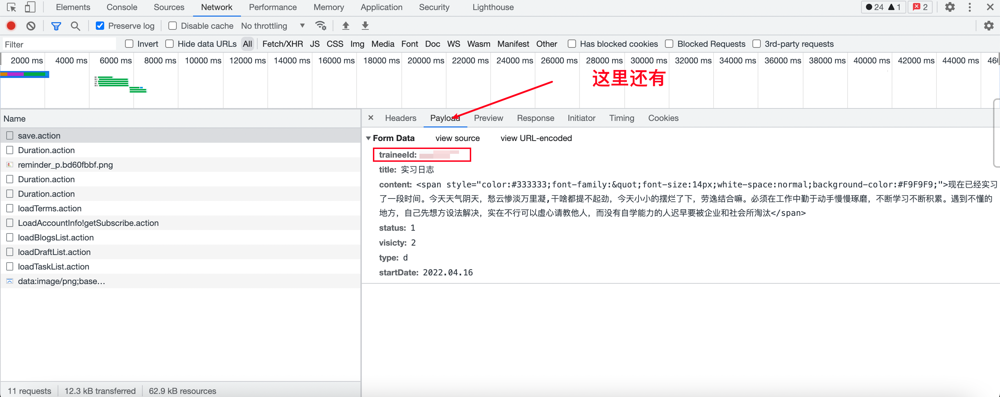
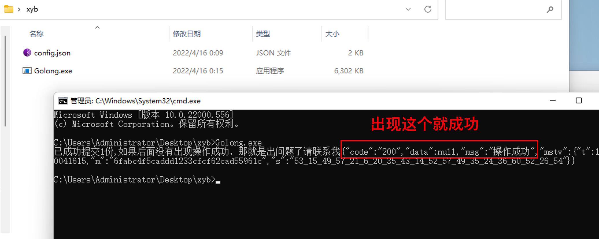

# XYB_Run
进阶版本的校友邦，日志填写工具，非常简单不需要任何环境有点电脑就行

## 前景提要

本来是python版本，让大家使用，但是呢，总有小白吧，是吧，那这时候呢，我们就进行才用GO工具进行4小时开发出来，从0基础开始开发的，出BUG轻点喷

在说一次针对可能有一定概率会bug，但是我没问题！看在我12点还在开发的面子上一定要点个小星星奥

## 工具使用方法

首先先去这里下载[Release V1.0.0 · Pyy-dev/XYB_Run (github.com)](https://github.com/Pyy-dev/XYB_Run/releases/tag/V1.0.0)

然后解压他，就会有3个文件，根据自己电脑选择使用，这里就拿win11演示，MAC我就不演示了太累了。

首先我们先看看配置文件

### 重点1

我们打开校友邦的官网https://www.xybsyw.com/，在直接到写日志的地方

打开F12，到网络这里进行抓包，这里会用burp的同学更好

然后正常填写，这里呢肯定有同学懒，复制吧

> 实习日志
>
> 现在已经实习了一段时间。今天天气阴天，愁云惨淡万里凝,干啥都提不起劲，今天小小的摆烂了下，劳逸结合嘛。必须在工作中勤于动手慢慢琢磨，不断学习不断积累。遇到不懂的地方，自己先想方设法解决，实在不行可以虚心请教他人，而没有自学能力的人迟早要被企业和社会所淘汰

然后成功抓到包

点开他将红框内的东西，复制到config.json里面

配置好了如下图

### 重点2

这个时间很重要

> 刚开始建议用1天来测试
>
> 比如我要自动填写2022年4月1到4月2日
>
> 就可以改成
>
> "2022","4","1","2"
>
> 就可以了
>
> 这里呢，我就用一天在测试一下。毕竟出bug删除很麻烦。

### 演示成品

放在同一个文件当中

直接执行就可以了

在自己看看平台，没问题完美

## 最后警告

自己实习自己写日记奥！出事了和我无关，我只是学习GO顺便写了一个工具而已！
